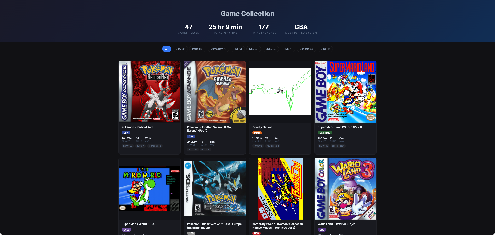

# Retro Collection

Generate and publish a beautiful HTML page showcasing your retro gaming collection with playtime statistics.



## Features

- Parses playtime data from muOS `track-game-time` module
- Separate cover images with lazy loading for fast page load
- "Now Playing" section with the most recently played game
- Shows total playtime, launches, and average session time per game
- Filter by system (NES, SNES, Genesis, etc.)
- Responsive design
- One-click publish from muOS console
- Uses rsync for efficient uploads (only syncs changed files)

## Installation

1. Copy `muos-app/` contents to `/mnt/sdcard/MUOS/application/RetroCollection/`

2. Generate SSH keypair and add to your server:
   ```bash
   ssh-keygen -t ed25519 -f retro_publish_key -N "" -C "retro-publisher"
   # Add retro_publish_key.pub to server's ~/.ssh/authorized_keys
   ```

3. Copy private key to the app directory on console

4. Edit `publish_collection.py` to set your server details:
   ```python
   REMOTE_HOST = "your-server.com"
   REMOTE_PORT = "22"
   REMOTE_USER = "username"
   REMOTE_BASE = "/path/to/html"
   ```

5. Launch "Publish Collection" from muOS Applications menu

## Server Setup

Simple nginx container with Caddy for HTTPS:

```yaml
# docker-compose.yml
services:
  nginx-retro:
    image: nginx:alpine
    volumes:
      - ./html:/usr/share/nginx/html:ro
    restart: unless-stopped
    labels:
      caddy: retro.example.com
      caddy.reverse_proxy: "{{upstreams 80}}"
    networks:
      - caddy

networks:
  caddy:
    external: true
```

## Data Sources

- **Playtime**: `/mnt/sdcard/MUOS/info/track/playtime_data.json`
- **Box art**: `/mnt/sdcard/MUOS/info/catalogue/<System>/box/`

## License

MIT
